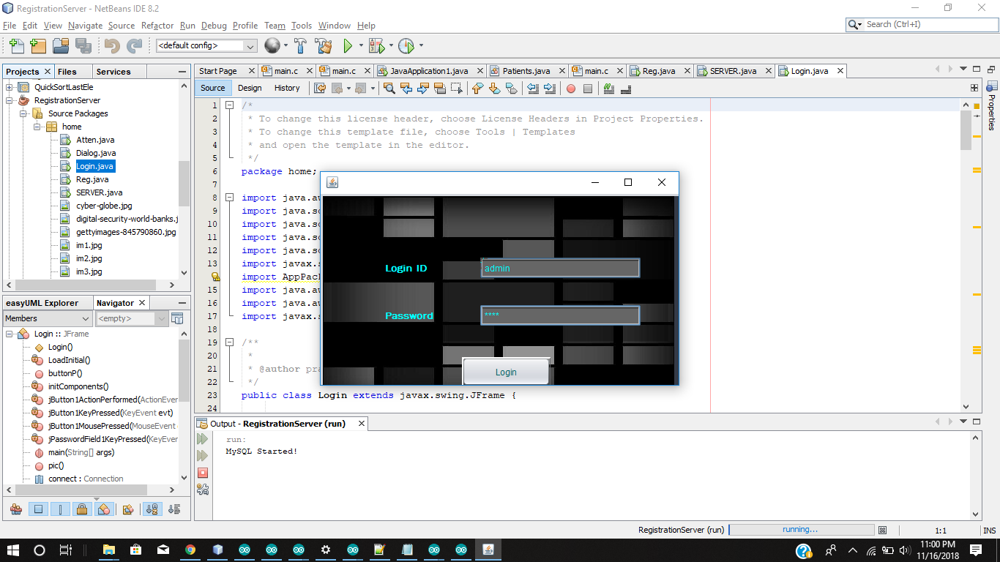
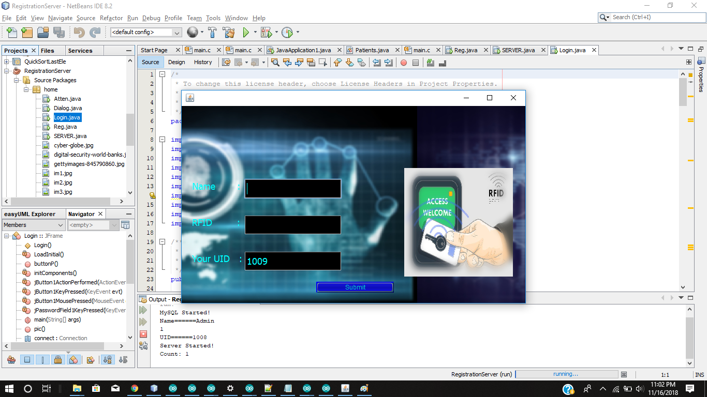
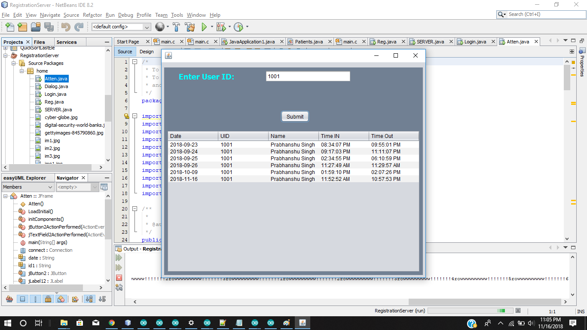

# RFID-based-attendance-system-and-door-lock

-The project is aimed mainly toward attendance management in Offices and Colleges. 

-The project required interfacing Arduino board(ESP32) with RFID sensor, a Servo motor(magnetic door lock can be used for practical implementation) and OlED display to display user information. Daily attendance is uploaded to a server created with JAVA and stored in MySQL Database.

Demo

Login Page

Registration Page

Attendance

